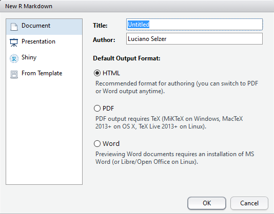

```{r setup, include=FALSE}
source("_chunk_opts.R")
library(htmltools)
```
## Reportes de análisis de datos

Cuando analizamos los datos queremos compartir nuestros resultados con 
nuestros colaboradores. 

Resulta tedioso copiar y pegar los resultados.

Y saber que figura es cual. O que resultados corresponde a que análisis

## Programación Literaria

Propuesta en 1970 por Donald Knuth

La idea detrás de eso es poder escribir texto y mezclarlo con el resultado
del código de computadora.

En R existe el paquete `knitr` que permite hacer eso: mezclar texto con código
de forma de producir tablas, análisis y figuras.

Pero knitr no permite formatear el texto

  - Para eso está R Markdown

## Creando un archivo de R Markdown


Dentro de RStudio, click File &rarr; New File &rarr; R Markdown y vas a ver
un dialogo como este:



Podemos quedarnos con la opción por defecto (_HTML output_), pero le damos
un título.


## Componentes básicos de R Markdown

El fragmento inicial instrucciones para R: el título, autor, fecha, y que
formato va a tener el documento.


```
---
title: "Documento de R Markdown Inicial"
author: "Luciano Selzer"
date: "23 de septiembre, 2015"
output: html_document
---
```

Se pueden borrar los campos que no querés. Las comillas dobles no son 
estrictamente _necesarias_. Solo si hay alguna comilla simple.

---

RStudio crea el documento con ejemplos para empezar.
Los fragmentos de código tienen la estructura parecida a la de abajo.

<pre>
&#96;&#96;&#96;{r}
summary(cars)
&#96;&#96;&#96;
</pre>


Estos fragmentos de código van a ser ejecutados por knitr y reemplazados
por sus resultados.

También hay una dirección web entre corchetes angulares (`< >`) como también
doble asteriscos en `**Knit**`. Esto es
[Markdown](http://daringfireball.net/projects/markdown/syntax).

## Markdown

Es un sistema para escribir páginas web en formato liviano.
En vez de código html se marca el texto con marcas que luego se _convierten_
en código html válido.

Por ahora, borremos todos y veamos como se puede formatear el texto con 
markdown.

---

Podes poner el texto en:

formato      código
------------ --------------
**negrita**   `**negrita**`
               `__negrita__`
_italica_      `*italica*`
               `_italica_`
~~tachado~~    `~~tachado~~`

----

Podemos hacer una lista con viñetas

```
* negrita con asteriscos dobles
* italica con guiones bajos
* código con comillas hacia atrás (backticks)
```

o así:

```
- negrita con asteriscos dobles
- italica con guiones bajos
- código con comillas hacia atrás (backticks)
```

---

O también así:

```
+ negrita con asteriscos dobles
+ italica con guiones bajos
+ código con comillas hacia atrás (backticks)
```
Cada una da el mismo resultado

+ negrita con asteriscos dobles
+ italica con guiones bajos
+ código con comillas hacia atrás (backticks)

---

Se puede usar una lista numerada usando solo número y ni siquiera hay que 
poner numeros consecutivos:

```
1. negrita con asteriscos dobles
1. italica con guiones bajos
1. código con comillas hacia atrás (backticks)
```

Esto aparece como:

1. negrita con asteriscos dobles
1. italica con guiones bajos
1. código con comillas hacia atrás (backticks)

---

Podes hacer titulos de sección de diferentes tamaños iniciando una linea
con algún número de simbolos `#`:

```
# Título
## Sección principal
### Sub-sección
#### Sub-sub sección
```

```{r, echo=FALSE,results='asis'}
h1("Título")
h2("Sección principal")
h3("Sub-sección")
h4("Sub-sub sección")
```

---

Podés _compilar_ el archivo R Markdown a una página html haciendo click
en "Knit HTML" arriba a la izquierda. 

Hay una referencia rápida en el menú de _Help_


## Ejercicio 1{.challenge}

Crea un nuevo documento de R Markdown. Borra todo su contenido y escribe algo
en Markdown (alguna secciones, negrita, italicas y una lista con viñetas).

Luego convierte el documento en una página web.


## Un poco más de markdown

Podés mostrar un hipervínculo así:

`[texto a mostar](http://el-sitio-web.com)`.

Podés incluir una imagen así: ``

Podés poner subíndices (e.g., F~2~) con `F~2~` y superíndices (e.g.,
F^2^) con `F^2^`.

---

Sí sabés escribir ecuaciones con 
[LaTeX](http://www.latex-project.org/), podes usar `$ $` y `$$ $$` para insertar ecuaciones como `$E = mc^2$` $E = mc^2$ y

```
$$y = \mu + \sum_{i=1}^p \beta_i x_i + \epsilon$$
```

$$y = \mu + \sum_{i=1}^p \beta_i x_i + \epsilon$$

Hay editores online https://www.codecogs.com/latex/eqneditor.php

## Fragmentos de código de R

El verdadero poder viene al mezclar markdown y fragmentos de código de R.
Esto es R Markdown. Cuando se compile el documento se va a ejectuar el 
código y luego se van a insertar los resultados del código (figuras, tablas, etc.)

---

Un fragmento de código se ve así:

<pre>
&#96;&#96;&#96;{r load_data}
gapminder <- read.csv("~/data/gapminder.csv")
&#96;&#96;&#96;
</pre>

That is, you place a chunk of R code between <code>&#96;&#96;&#96;{r chunk_name}</code>
and <code>&#96;&#96;&#96;</code>. It's a good idea to give each chunk
a name, as they will help you to fix errors and, if any graphs are
produced, the file names are based on the name of the code chunk that
produced them.

## Ejercicio 2{.challenge}
>
> Add code chunks to
>
> - Load the ggplot2 package
> - Read the gapminder data
> - Create a plot
{: .challenge}

## Como se compila

When you press the "Knit HTML" button, the R Markdown document is
processed by [knitr](http://yihui.name/knitr) and a plain Markdown
document is produced (as well as, potentially, a set of figure files): the R code is executed
and replaced by both the input and the output; if figures are
produced, links to those figures are included.

The Markdown and figure documents are then processed by the tool
[pandoc](http://pandoc.org/), which converts the Markdown file into an
html file, with the figures embedded.

```{r rmd_to_html_fig, fig.width=8, fig.height=3, fig.align="left", echo=FALSE}
par(mar=rep(0, 4), bty="n", cex=1.5)
plot(0, 0, type="n", xlab="", ylab="", xaxt="n", yaxt="n",
     xlim=c(0, 100), ylim=c(0, 100))
xw <- 10
yh <- 35
xm <- 12
ym <- 50
rect(xm-xw/2, ym-yh/2, xm+xw/2, ym+yh/2, lwd=2)
text(xm, ym, ".Rmd")

xm <- 50
ym <- 80
rect(xm-xw/2, ym-yh/2, xm+xw/2, ym+yh/2, lwd=2)
text(xm, ym, ".md")
xm <- 50; ym <- 25
for(i in c(2, 0, -2))
    rect(xm-xw/2+i, ym-yh/2+i, xm+xw/2+i, ym+yh/2+i, lwd=2,
         border="black", col="white")
text(xm-2, ym-2, "figs/")

xm <- 100-12
ym <- 50
rect(xm-xw/2, ym-yh/2, xm+xw/2, ym+yh/2, lwd=2)
text(xm, ym, ".html")

arrows(22, 50, 38, 50, lwd=2, col="slateblue", len=0.1)
text((22+38)/2, 60, "knitr", col="darkslateblue", cex=1.3)

arrows(62, 50, 78, 50, lwd=2, col="slateblue", len=0.1)
text((62+78)/2, 60, "pandoc", col="darkslateblue", cex=1.3)
```


## Opciones de fragmentos

There are a variety of options to affect how the code chunks are
treated.

- Use `echo=FALSE` to avoid having the code itself shown.
- Use `results="hide"` to avoid having any results printed.
- Use `eval=FALSE` to have the code shown but not evaluated.
- Use `warning=FALSE` and `message=FALSE` to hide any warnings or
  messages produced.
- Use `fig.height` and `fig.width` to control the size of the figures
  produced (in inches).

So you might write:

<pre>
&#96;&#96;&#96;{r load_libraries, echo=FALSE, message=FALSE}
library(dplyr)
library(ggplot2)
&#96;&#96;&#96;
</pre>

Often there will be particular options that you'll want to use
repeatedly; for this, you can set _global_ chunk options, like so:

<pre>
&#96;&#96;&#96;{r global_options, echo=FALSE}
knitr::opts_chunk$set(fig.path="Figs/", message=FALSE, warning=FALSE,
                      echo=FALSE, results="hide", fig.width=11)
&#96;&#96;&#96;
</pre>

The `fig.path` option defines where the figures will be saved. The `/`
here is really important; without it, the figures would be saved in
the standard place but just with names that being with `Figs`.

If you have multiple R Markdown files in a common directory, you might
want to use `fig.path` to define separate prefixes for the figure file
names, like `fig.path="Figs/cleaning-"` and `fig.path="Figs/analysis-"`.


> ## Ejercicio 3
>
> Use chunk options to control the size of a figure and to hide the
> code.
{: .challenge}


## Código de R en linea

You can make _every_ number in your report reproducible. Use
<code>&#96;r</code> and <code>&#96;</code> for an in-line code chunk,
like so: <code>&#96;r round(some_value, 2)&#96;</code>. The code will be
executed and replaced with the _value_ of the result.

Don't let these in-line chunks get split across lines.

Perhaps precede the paragraph with a larger code chunk that does
calculations and defines things, with `include=FALSE` for that larger
chunk (which is the same as `echo=FALSE` and `results="hide"`).

I'm very particular about rounding in such situations. I may want
`2.0`, but `round(2.03, 1)` will give just `2`.

The
[`myround`](https://github.com/kbroman/broman/blob/master/R/myround.R)
function in my [R/broman](https://github.com/kbroman) package handles
this.

> ## Ejercicio 4
>
> Try out a bit of in-line R code.
{: .challenge}


## Other output options


> ## Tip: Creating PDF documents
>
> Creating .pdf documents may require installation of some extra software. If
> required this is detailed in an error message.
>
> Tex for windows is available [here](http://miktex.org/2.9/setup).
>
> Tex for mac is available [here](http://tug.org/mactex).
{: .callout}


## Recursos

- [Knitr in a knutshell tutorial](http://kbroman.org/knitr_knutshell)
- [Dynamic Documents with R and knitr](http://www.amazon.com/exec/obidos/ASIN/1482203537/7210-20) (book)
- [R Markdown documentation](http://rmarkdown.rstudio.com)
- [R Markdown cheat sheet](http://www.rstudio.com/wp-content/uploads/2015/02/rmarkdown-cheatsheet.pdf)
