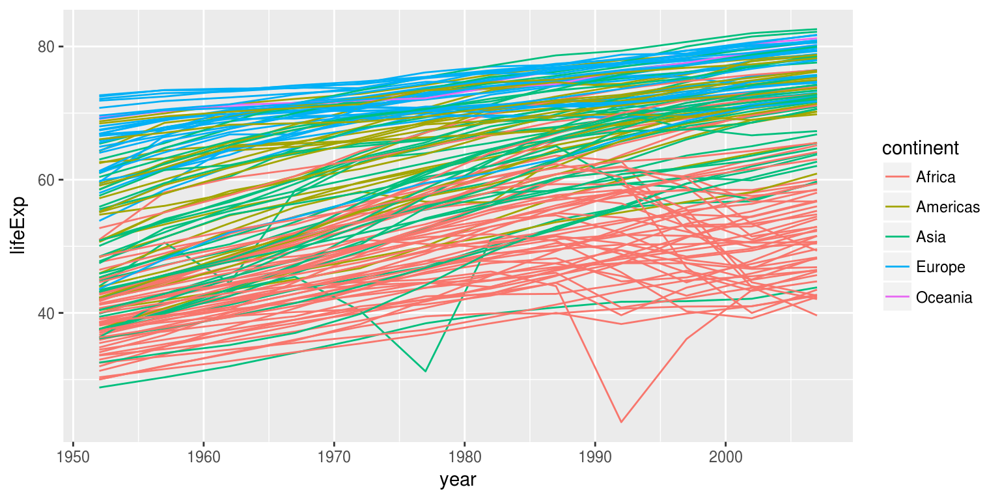
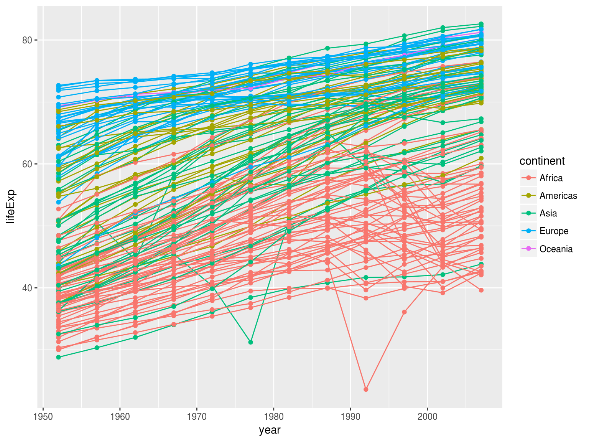
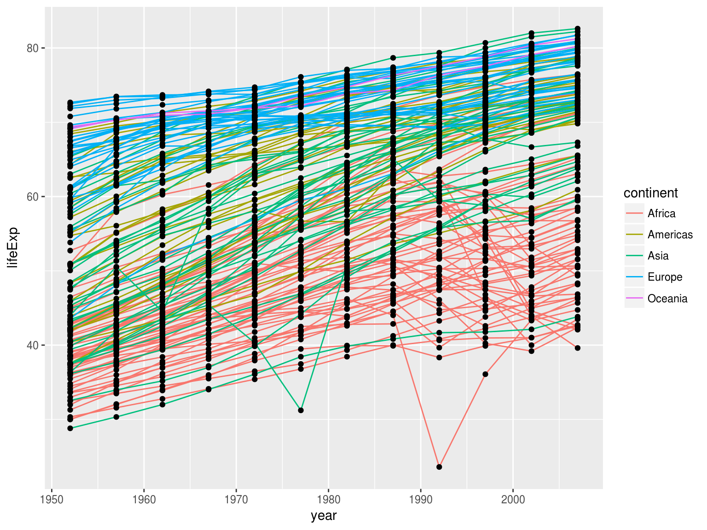

```{r setup, include=FALSE}
source("_chunk_opts.R")
# Silently load in the data so the rest of the lesson works
gapminder <- read.csv("data/gapminder-FiveYearData.csv", header=TRUE)

library(knitr)

# I want the README to have visible GIFs on GitHub, as
# GitHub cannot show .mp4s or other animation formats.
# I therefore hacked together a GIF animation hook for knitr.

library(animation)
ani.options(autobrowse = FALSE, interval = 0.1)

opts_knit$set(animation.fun = function(x, options, format = "gif") {
  x = c(knitr:::sans_ext(x), knitr:::file_ext(x))
  fig.num = options$fig.num
  format = sub("^[.]", "", format)
  fig.fname = paste0(sub(paste0(fig.num, "$"), "*", x[1]), 
                     ".", x[2])
  mov.fname = paste0(sub(paste0(fig.num, "$"), "", x[1]), ".", 
                     format)

  # order correctly
  figs <- Sys.glob(fig.fname)
  figs <- figs[order(as.numeric(stringr::str_match(figs, paste0("(\\d+)\\.", x[2]))[, 2]))]

  animation::im.convert(figs, output = mov.fname)
  
  sprintf("", options$label, paste0(opts_knit$get("base.url"), mov.fname))
})

```

## Sistemas gráficos en R

Los gráficos son una de las maneras de explorar nuestros datos rápidamente.

En R existen varios sistemas gráficos

+ Sistema gráfico de base
+ Lattice
+ ggplot2
+ Otros

## ggplot2

El sistema de gráficos de ggplot está contruido sobre la idea de que los
gráficos pueden construirse a partir de un conjunto de componentes:

+ Los datos
+ El sistema de coordenadas
+ Los objetos geométricos `geom` -- representaciones de los datos

Una clave es que los gráficos se contruyen por capas.


---

```{r, fig.height= 4}
library("ggplot2")
ggplot(data = gapminder, aes(x = gdpPercap, y = lifeExp)) +
  geom_point()
```

---

La función `ggplot` le dice a R que queremos hacer un gráfico
y establece todas las opciones para el resto de las capas que agreguemos.
Es posible, sobreescribir estas opciones en cada capa si es lo que queremos.

+ `data` datos
+ `aes` como mapear los datos


---

Si solo usamos `ggplot` muestra el gráfico vacío.

```{r, fig.height= 4}

ggplot(data = gapminder, aes(x = gdpPercap, y = lifeExp))
```

---

Tenemos que decirle como queremos representar nuestros datos.
Con una nueva capa **geom**. Por ejemplo, puntos:

```{r, fig.height= 4}
ggplot(data = gapminder, aes(x = gdpPercap, y = lifeExp)) +
  geom_point()
```

## Ejercicio 1{.challenge}

Modifica el gráfico de ejemplo para mostrar como ha cambiado la expectativa de
vida con el tiempo:

```{r, eval=FALSE}
ggplot(data = gapminder, aes(x = gdpPercap, y = lifeExp)) +
  geom_point()
```

Pista: el set de datos `gapminder` tiene una columna `year`(año).

## Ejercicio 2{.challenge}

En el ejemplo anterior y el ejercicio usamos la función `aes` para decirle
al `geom_point()` la ubicación x e y de cada punto. Hay otra propiedad estetica
que podemos modificar en el punto, el *color*. Modifica el gráfico anterior
para agregar color a cada punto según el continente. ¿Ves alguna tendencia en
tus datos? ¿Son lo que esperabas?

## Capas

Un diagrama de puntos no es la mejor forma para mostrar el cambio en el tiempo.
Es mejor usar una gráfica de lineas.

```{r capas, fig.height=4, fig.show='hide'}
ggplot(data = gapminder, 
       aes(x = year, y = lifeExp, 
           by = country, color = continent)) +
  geom_line()
```

---

```{r, echo=FALSE}

```

En vez de usar `geom_point()` usamos `geom_line()` y hay que agregar el
argumento `by` a `aes` para que una las lineas según el país.

---

¿Pero si queremos ver los puntos y las lineas a la vez? Añadimos otra capa a
nuestro gráfico:

```{r lineas-puntos, fig.show='hide'}
ggplot(data = gapminder, 
       aes(x = year, y = lifeExp,
           by = country, color = continent)) +
  geom_line() + geom_point()
```

---

```{r, echo=FALSE}

```

---

Cada capa es dibujada por encima de la anterior

```{r lineas-puntos-negros, fig.show='hide'}
ggplot(data = gapminder, 
       aes(x = year, y = lifeExp, by = country)) +
  geom_line(aes(color = continent)) + geom_point()
```

---

```{r, echo=FALSE}

```

## Ejercicio 3{.challenge}

Cambia el orden de las capas de lineas y puntos
¿Qué sucede?

## Transformaciones y Estadísticas

También es fácil realizar tranformaciones de los datos y superponer
modelos estadísticos.

---


```{r, echo=FALSE}
knitr::include_graphics("fig/rmd-unnamed-chunk-1-1.png")
```

En nuestro primer gráfico era difícil ver la relación entre GDP y la expectativa
de vida

---

```{r, fig.height=4}
ggplot(data = gapminder, aes(x = gdpPercap, y = lifeExp)) +
  geom_point(alpha = 0.5) + scale_x_log10()
```

Tranformamos los datos de GDP antes de graficarlos con log10 y también
agregamos transparencia para que se vean los puntos donde están agrupados

---

Podemos mostrar la relación lineal que hay entre nuestros datos.

```{r, fig.height=4}
ggplot(data = gapminder, aes(x = gdpPercap, y = lifeExp)) +
  geom_point() + scale_x_log10() + geom_smooth(method = "lm")
```

---

Hacer la linea más gruesa (o más fina) con el argumento **size**:

```{r, fig.height=4}
ggplot(data = gapminder, aes(x = gdpPercap, y = lifeExp)) +
  geom_point() + scale_x_log10() + geom_smooth(method = "lm", size = 1.5)
```

## *Aesthetics*

Hay dos formas de especificar la estetica de una geometría:

+ Definiendola como un valor: dentro de `geom_*()`
+ Mapeandola a los datos: dentro de `aes()`

## Ejercicio 4{.challenge}

1. Modifca el color y tamaño de los puntos en el ejemplo anterior.

Pista: no uses `aes()`

2. Modifca la solución anterior para que ahora los puntos sean de distinto
color y forma según el continente agregando una nueva linea de tendencia.


## Figuras multipanel

Podemos hacer figuras con un panel por cada uno de los paises. Nos vamos a
enfocar en los que empiezan con A o Z.

Con `facet_*()` podemos hacer que cada país tenga su panel.


```{r, eval=FALSE}
starts.with <- substr(gapminder$country, start = 1, stop = 1)
az.countries <- gapminder[starts.with %in% c("A", "Z"), ]
ggplot(data = az.countries, 
       aes(x = year, y = lifeExp, color = continent)) +
  geom_line() + facet_wrap( ~ country)
```

---

```{r, echo=FALSE}
starts.with <- substr(gapminder$country, start = 1, stop = 1)
az.countries <- gapminder[starts.with %in% c("A", "Z"), ]
ggplot(data = az.countries, aes(x = year, y = lifeExp, color = continent)) +
  geom_line() + facet_wrap( ~ country)
```


## Modificando el texto

Para obtener una figura para publicar es necesario cambiar algunas cosas. 
Por ejemplo el nombre de los ejes debería estar completo.

Para controlar la apariencia general del gráfico usamos `theme()`.
Para controlar cosas específicas a los ejes, escalas de colores, formas, etc. 
usamos `scale_*()`. 

El nombre de los ejes lo podemos controlar desde `scale_*()` o desde `xlab()`
`ylab()`

---

```{r figura-1-final, fig.show='hide'}
ggplot(data = az.countries, 
       aes(x = year, y = lifeExp, color = continent)) +
  geom_line() + 
  facet_wrap( ~ country) +
  xlab("Year") +
  ylab("Life expectancy") + 
  ggtitle("Figura 1") +
  scale_colour_discrete( name = "Continent") +
  theme(strip.text = element_text(size = 13))
```

---

```{r, echo=FALSE}
knitr::include_graphics("fig/rmd-figura-1-final-1.png")
```


---


Hay muchas más cosas que se pueden hacer con ggplot.


```{r, echo=FALSE, fig.show='animate', message=FALSE, results='hide', fig.height=5, cache=TRUE}
  # Cargar paquetes
if(!require(gganimate)) {
  if(!require(devtools)) install.packages("devtools")  
  devtools::install_github("dgrtwo/gganimate")
}
library(gganimate)
if(!require(tweenr)) {
  if(!require(devtools)) install.packages("devtools")  
  devtools::install_github("thomasp85/tweenr")
}
library(tweenr)
library(dplyr)

# Agregar una columna con la forma de ease es como es la velocidad de la interpolación
# Y tranformar el factor en númerico por un bug en tweenr
gapminder_2 <- gapminder %>% 
  transform(ease = rep("cubic-in-out", nrow(gapminder)),
            continent = as.numeric(continent))

#Interpolar elementos entre años por país
gapminder_tw <- tween_elements(gapminder_2,
                                time = "year", 
                                group = "country", 
                                ease = "ease",
                                nframes = 120)

# Volver continente a factor
gapminder_tw <- transform(gapminder_tw, 
                          continent = factor(continent,
                                             labels = levels(gapminder$continent))
)
#Solo elegir un año por frame para graficar como "titulo"
year <- gapminder_tw[!duplicated(gapminder_tw$year), c("year", ".frame")] %>% transform(year = round(year))

p <- ggplot(gapminder_tw, 
            aes(gdpPercap, lifeExp, frame = .frame)) +
  geom_point(aes(size = pop,
                color = continent)) + # punto con tamaño como población y color como continente
  geom_text(data = year, aes(x = mean(gapminder$gdpPercap), # agregar el texto del año en la mitad del gdp
           y = max(gapminder$lifeExp) + 1, label = year), size = 12) + # y el máximo de lifeExp +1 para no tapar nada
  scale_x_log10() +
  xlab("PBI per capita") +
  scale_y_continuous("Expectativa de vida") +
  scale_color_discrete("Continente") +
  scale_size_continuous("Población") +
  theme_light(20)


gg_animate(p, title_frame = FALSE)
---

+ Hay documentación detallada en el sitio web: http://docs.ggplot2.org/current/
+ Hay un machete muy util en RStudio.
+ Y en cookbookR hay instrucciones detalladas de como hacer el 99% de las cosas.
