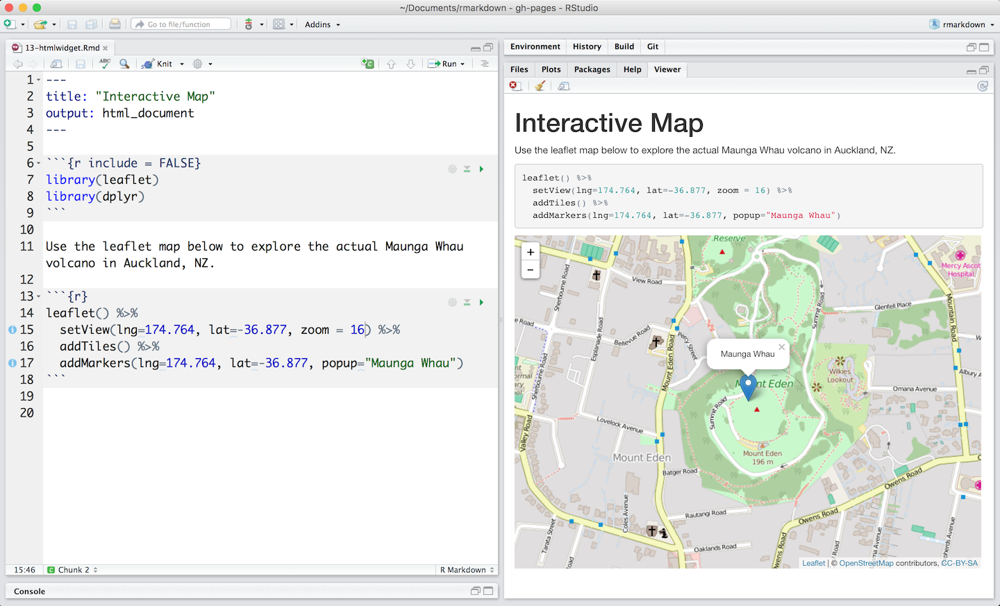

```{r setup, include=FALSE}
source("_chunk_opts.R")
```

# ¿Qué es R?


## R es:
- Es un lenguaje de programación
  - Interactivo
  - Programática
- Software Libre
- Muchos usuarios
    - Nuevas técnicas
    - Infinidad de usos

## Usos

- Análisis de datos experimentales
  - Regresiones: Lineal, GLM, GLMM, GAM
  - Análisis Multivariado: CCA, PCA
  - Análisis no Paramétrico
  - Text Mining
- Usado en:
  - Laboratorios de Investigación
  - Agencias Gubernamentales
  - Empresas
  

## ¿Qué se puede hacer?

- Realizar pre-procesado de datos
- Analizar datos
- Crear aplicaciones web
- Realizar reportes dinámicos
- Esta presentación
- Crear nuestras propias rutinas o algoritmos

---



---


# Prerrequisitos

## R

Para bajarlo ir a [https://cran.r-project.org/](https://cran.r-project.org/),


## GIT

Control de Versión  
[https://git-scm.com/](https://git-scm.com/)

## RStudio

*RStudio Desktop*
https://www.rstudio.com/products/rstudio/download2/ 

## Crear Cuenta en GitHub

https://github.com/

- Completar el formulario
- Presionar *Sign Up for GitHub*.
- Verificar cuenta de correo

## Configuración de RStudio

Para esto hay que:

- abrir RStudio 
- ir al menú `Tools\Global Options` 
- luego ir a `Git\SVN`, el anteúltimo icono.

Si utilizaron la instalación por defecto de Git la ruta es
`C:\Program Files\Git\bin` si tienen Windows 32 bits o 
`C:\Program Files (x86)\Git\bin` si tienen Windows 64 bits. La carpeta 
`Program Files` puede llamarse `Archivos de Programa` si tienen Windows en español. 

- Presionar `Ok`.

## Configurar GitHub

## En Rstudio: 

1. Vayan a `Tools\Global Options...`, luego
a la pestaña de `Git\SVN`. 
2. Ahí deben hacer clic en `create RSA key`. Pueden
poner una `Passphase`. 
3. Presionan `Create`, les va a aparecer un cartel y ponen `Ok`.
4. Luego, presionan en `View public key`. Copian la clave.

## En el sitio web de [Github](https://www.github.com):

1. En la esquina superior derecha hay un icono que es su foto de usuario. Hacen
clic ahí y luego en `Settings`.
2. Van la pestaña `SSH and GPG keys`.
3. Luego, presionan en `New SHH Key`.
4. En *Title* ponen el nombre del programa que lo va a usar. **RStudio** en nuestro caso.
5. En *Key* pegan lo que han copiado de RStudio.
6. Finalmente, presionan `Add SSH Key`

# Introducción

## Introducción a RStudio

- Interfaz de desarrollo integrada (IDE)
- gratis
- código abierto.
- Editor de código, 
- Múltiples plataformas (incluyendo servidores)
- Muchas ventajas:
  - Integración con control de versión
  - Manejo de proyectos

## Disposición Básica
 
  +  La consola interactiva de R (a la izquierda)
  +  El Entorno/Historial, en inglés Environment/History (en pestañas en la parte superior derecha)
  +  Archivos/Gráficos/Paquetes/Ayuda/Visualizador, también en inglés Files/Plots/Packages/Help/Viewer (en la parte inferior derecha)
  
Una vez que abre un archivo, como por ejemplo un script de R, un panel de edición
se abre en la parte superior izquierda.

## Flujo de trabajo con RStudio

Hay dos maneras básicas de trabajar con RStudio.

1. Probar y jugar dentro de la consola interactiva y luego copiar el código a un
archivo .R para ejecutar más tarde.
   *  Funciona bien cuando se hacen pequeñas pruebas y recién se comienza.
   *  Pero rápidamente se vuelve laborioso.
2. Empezar a escribir un archivo .R y luego usar el comando / atajo de RStudio para
ejecutar la línea actual o las líneas seleccionadas en la consola.
   * Es la mejor forma de empezar; así todo el código queda guardado para más
   tarde
   * Podrás ejecutar el archivo desde RStudio o usando la función de R
   `source()`.
   
## Tip: Ejecutando partes de tu código{.tip}


1. hacer click en el botón `Run` arriba del panel de edición,
2. Seleccionar "Run Lines" desde el menú "Code", o 
3. apretar Ctrl+Enter en  Windows o Linux o Command+Enter en OS X (
Este atajo también puede verse dejando el puntero del mouse sobre el botón `Run`).

Para ejecutar un bloque de código:
+ Seleccionálo y después solo presiona `Run`. 

Si has modificado una parte del bloque que has ejecutado recién podés usar el botón a continuación, `Re-run the previous region`.


