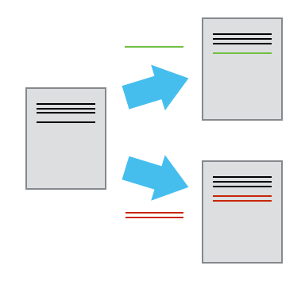
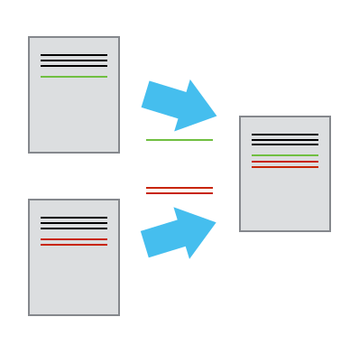
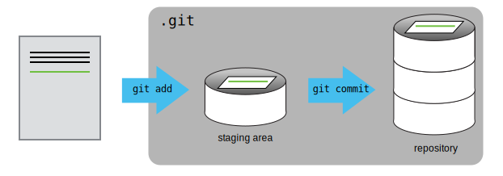
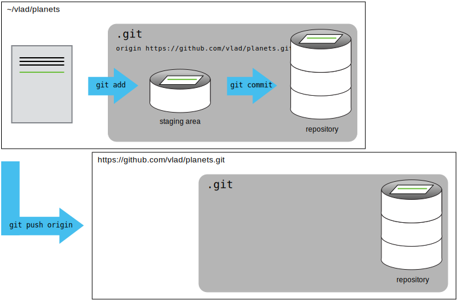

```{r setup, include=FALSE}
source("_chunk_opts.R")
```

# Manejo de Proyectos con RStudio 

## Introducción

> Managing your projects in a reproducible fashion doesn't just make your 
> science reproducible, it makes your life easier
--Vince Buffalo (@vsbuffalo)

---

La mayoría de la gente organiza sus proyectos así:


---

Hay muchas razones por las cuales *SIEMPRE* deberían evitar esto:

1. Es muy dificil cual es la versión original de tus datos y cual es la
modificada;
2. Se vuelve un lío porque mezcla archivos de varias extensiones juntos;
3. Probablemente te tomará mucho tiempo encontrar el archivo que realmente buscas,
y ver cuales son las figuras correctas y cual es el código que las genera

---


Un buen diseño de proyecto va a ser tu vida más fácil:

  + Te va a ayudar a mantener la integridad de tus datos;
  + Va a ser que sea más sencillo compartir tu código con alguien más 
  (Un compañero de laboratorio, colaborador, o supervisor);
  + Te permite subir fácilmente código con tu propuesta de manuscrito;
  + Hace que sea más fácil volver a un proyecto luego de dejarlo por un tiempo.

## Una posible solución

Afortunadamente, hay herramientas y paquetes que pueden ayudarte a manejar
el trabajo de forma efectiva.

Una de los aspectos más poderosos y útiles de RStudio es el manejo de proyectos.
Hoy vamos a usarlo para crear un proyecto auto-contenido y reproducible.


## Desafio: Crear un proyecto autocontenido{.challenge}

Vamos a crear un proyecto auto-contenido en RStudio:

1. Hacer clic en "File" en el menú, y luego en "New Project"
2. Click en "New Directory"1
3. Click en "Empty Project"
4. Escribir el nombre de la carpeta donde se guardará el proyecto, e.g.
"mi_proyecto"
5. Asegurarse de que la casilla "Create a git repository" esté seleccionada.
6. Click en el botón "Create Project"


## Buenas prácticas para manejo de proyectos

Aunque no hay una manera que sea la "mejor" para diseñar un proyecto, si hay 
alguno lineamientos principales a seguir que harán el manejo de proyecto más
sencillo:

+ Tratar los datos como solo lectura
+ Limpieza de datos
+ Trata la salida generada como descartable

## Tip: Prácticas suficientemente buenas para la computación científica{.tip}

[Good Enough Practices for Scientific Computing](https://github.com/swcarpentry/good-enough-practices-in-scientific-computing/blob/gh-pages/good-enough-practices-for-scientific-computing.pdf) da las siguientes
recomendaciones para la organización de proyectos:

1. Poner cada proyecto en su propia carpeta.
2. Poner los documentos de texto en carpeta `doc`.
3. Poner los datos "crudos" en una carpeta  `data`
4. Poner los datos limpios en una `results`.
4. Poner el código de fuente del proyecto en
`scr` y programas externos o compilados en  `bin`.
5. Nombrar todos los archivos de forma que refleje su contenido o función.


## Tip: ProjectTemplate - una posible solución{.tip}

Una forma de automatizar el manejo de proyectos es instalar un paquete de
terceros, `ProjectTemplate`. Este paquete va a configurar una estructura ideal
para el manejo del proyecto.

## Separa la definición de la función de su aplicación

Es buena idea separar estas funciones
en un carpeta distinta;
+ una carpeta para las funciones útiles que vas a reusar
entre análisis y proyectos 
+ otra para guardar los scripts de análisis.
+ Evitar la duplicación

## Guarda los datos en la carpeta data

Descarga los datos de gapminder de [aquí](https://raw.githubusercontent.com/resbaz/r-novice-gapminder-files/master/data/gapminder-FiveYearData.csv).

1. Descarga el archivo (CTRL + S, click botón derecho -> "Guardar como", o 
Archivo -> "Guardar página como")
2. Asegúrate que el archivo guardado tiene el nombre `gapminder-FiveYearData.csv`.
3. Guarda el archivo en la carpeta `data/` dentro de tu proyecto.

Más tarde vamos a cargar e inspeccionar estos datos.

# Control de Versión

## Control de Versión en RStudio

También hemos configurado nuestro proyecto para que se integre con git, 
poniendolo bajo control de versión. RStudio tiene una buena interfaz a git
que la consola, pero es muy limitada por lo que a veces será necesario usar
la consola. Vamos a hacer confirmación (*commit*)  inicial de nuestros archivos.

El panel de "Environment/History"" también tiene el panel de "Git".

## Tip: versionando salida descartable{.tip}

En general no querés versionar las salidas descartable (o los datos de solo 
lectura). Hay que modificar el archivo `.gitignore` para decirle que ignore
estos archivos y carpetas.

## Ejercicio 2{.challenge}

1. Crea una carpeta dentro del proyecto llamada `graphs`.
2. Modifica el archivo `.gitignore` para que contenga `graphs` para
que estas salidas descartables no sean versionadas. 


## Breve Introducción a Git

```{r, out.height= 400, fig.retina = NULL, echo=FALSE}
knitr::include_graphics("../img/phd101212s.gif")
```

---


## Git es un sistema de control de versión


Cada vez que confimamos un archivo a git este le saca una "instatanea"


## Colaborando



## Fusionando


## Tracked vs Untracked

Los archivos pueden tener dos estados básicos:

  + Untracked (sin seguimiento)
  + Tracked (con seguimiento)


 + `git add` 
 + `git comit`
 



## Repositorios Remotos

Permite que otros colaboradores tengan copias de nuestro trabajo.

También sirve de backup.


```{bash, eval=FALSE}
git remote add origin git@github.com:EstadisticaUNTDF/test.git
```


Con esto estamos diciendo a git que añada un servidor remoto llamado *origin*
y a continuación le damos la *URL*.

```{bash, eval=FALSE}
git remote
```


## Subiendo los cambios

El comando `git push` nos permite subir los cambios al
servidor.


